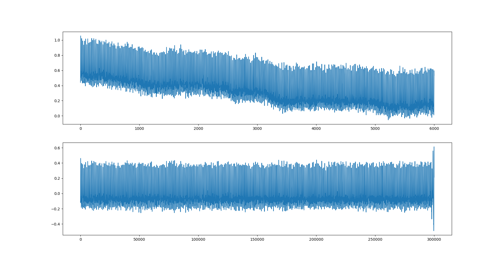
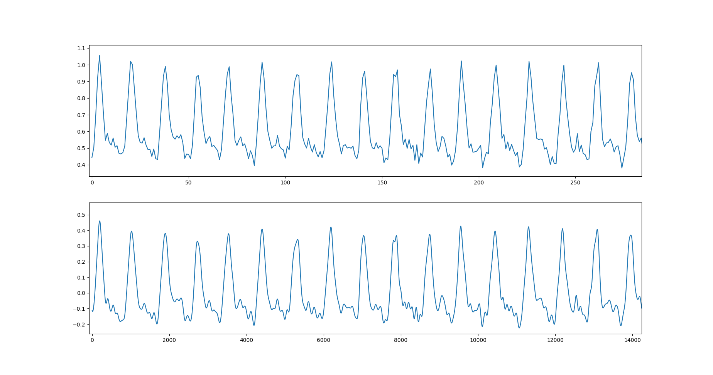
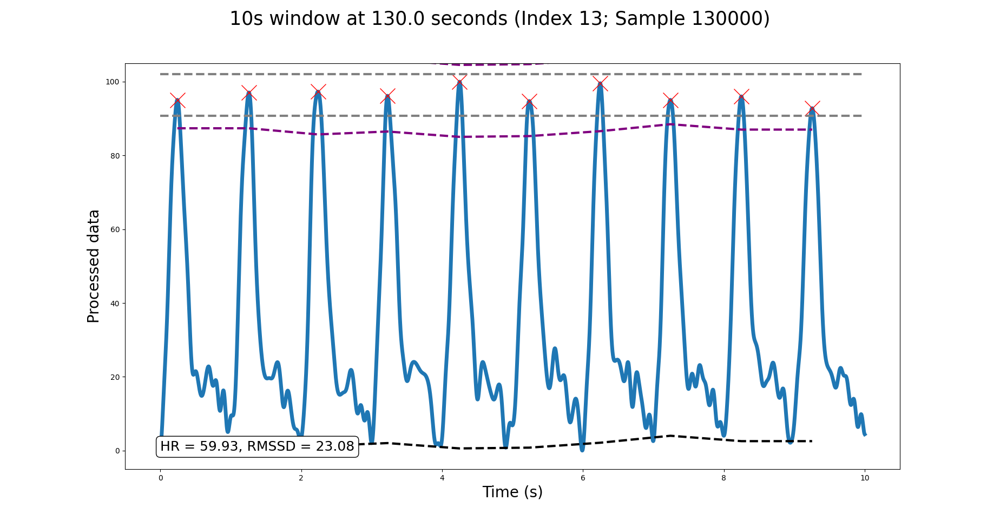
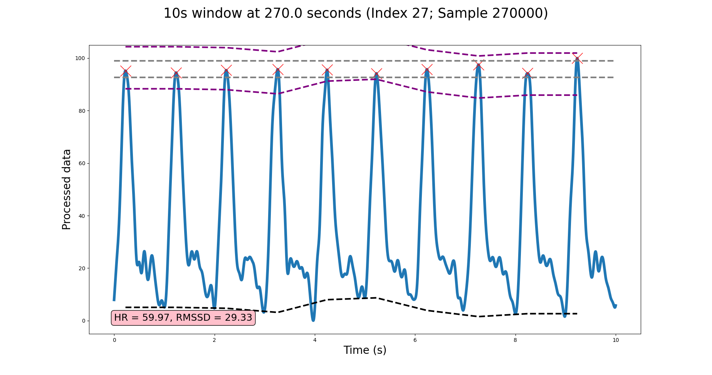

# RapidHRV Tutorial

This tutorial demonstrates how to preprocess, analyze, and visualize data. Attached is an example dataset: a 5 minute 
segment of simulated PPG data downsampled to 20Hz and with added white gaussian noise (20dB). First, we need to import 
packages and load the data.

```python
import numpy as np
from rapidhrv import preprocess, analyze, visualize

data = np.load('Example_data.npy')
```

Next, we can upsample, filter, and smooth the data using the preprocessing module.

```python
procData = preprocess.preprocess(inputdata=data, samplingrate=20)
```

Here, we can see high-pass filtering has helped with the drift...



...and upsampling/smoothing has increased the temporal precision of peaks within the data.




We can now submit this data to analysis...

```python
analyzedData = analyze.extract_heart(inputdata=procData, resampledrate=1000)
```
...which outputs a dictionary containing the analyzed time series ('data') and parameter arguments used for analysis 
('features').


Lastly, we can use the visualization module to have a check that RapidHRV is doing its job.


```python
fig = analyze.extract_heart(inputdata=procData, inputframe=analyzedData)
```

This plots the time series of analyzed data.


We can then click on specific datapoints to check performance. RapidHRV is performing as expected here.



In this analysis, we can see some rejected cases (in the analyzed time series) which contained otherwise usable
data. In the instance below, this is due to the last peak's height.



As the signal here is relatively clean, small deviations are being detected as noise. Therefore, you may want to 
either: 1) use the uncleaned time series (e.g. analyzedData['data']['RMSSD']); or 2) relax outlier rejection thresholding (e.g. outliermethod='liberal').

Final script:


```python
import numpy as np
from rapidhrv import preprocess, analyze, visualize

data = np.load('Example_data.npy')

procData = preprocess.preprocess(inputdata=data, samplingrate=20)

analyzedData = analyze.extract_heart(inputdata=procData, resampledrate=1000)

fig = analyze.extract_heart(inputdata=procData, inputframe=analyzedData)
```
